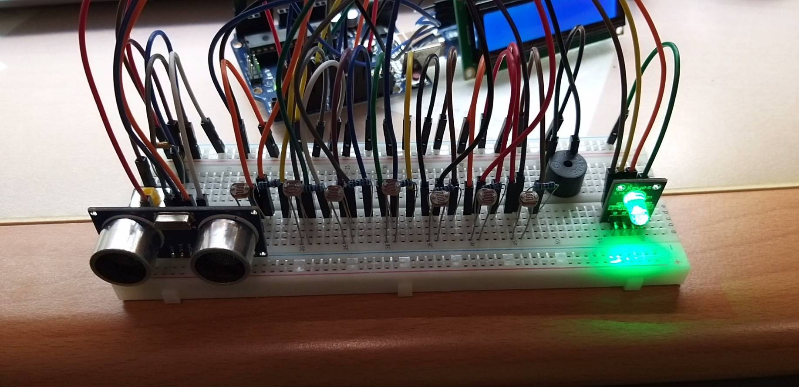

# Mini Piano

## Embedded System
### Designed through Arduino.

### Components
#### - Photoresistor: as the piano keys
#### - Ultrasonic sensor: detect the distance to change the pitch between tenor and middle pitch
#### - buzzer
#### - button: change mode(NORMAL, RECORD, PLAYING)
#### - RGB LED: flash red when it's RECORD mode, flash green when it's playing mode
#### - LCD Display: display mode name and pitch name

